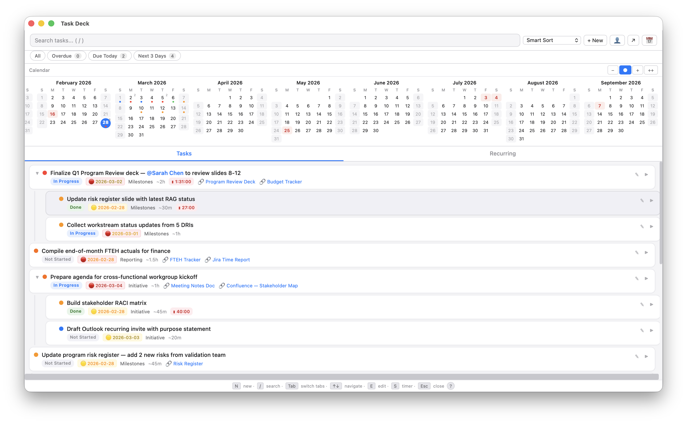
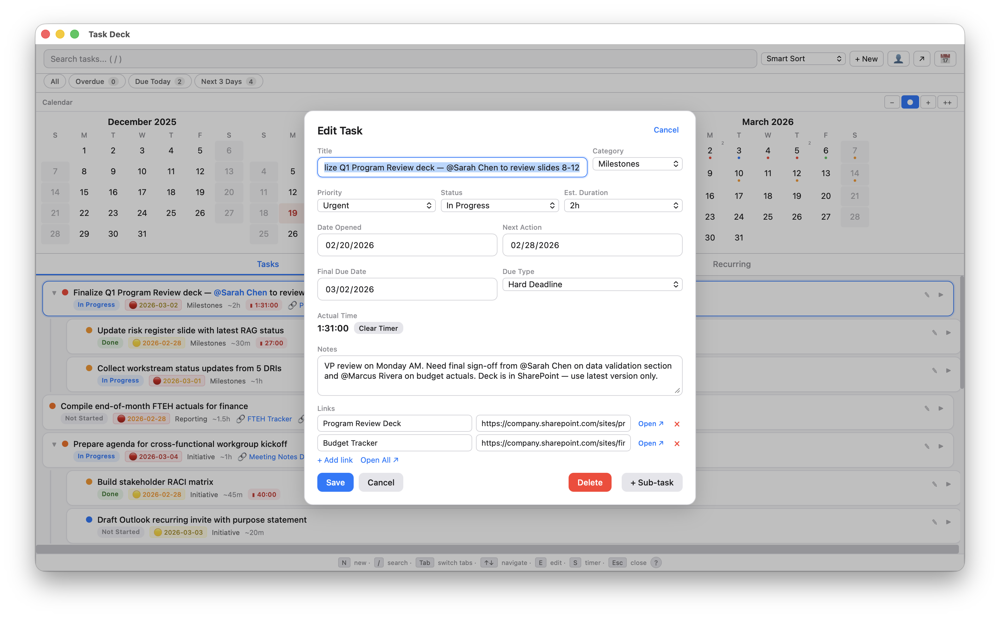
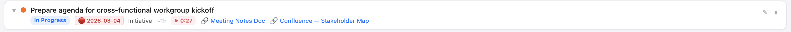
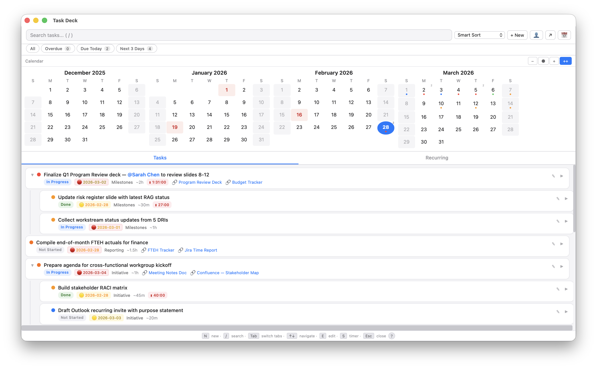
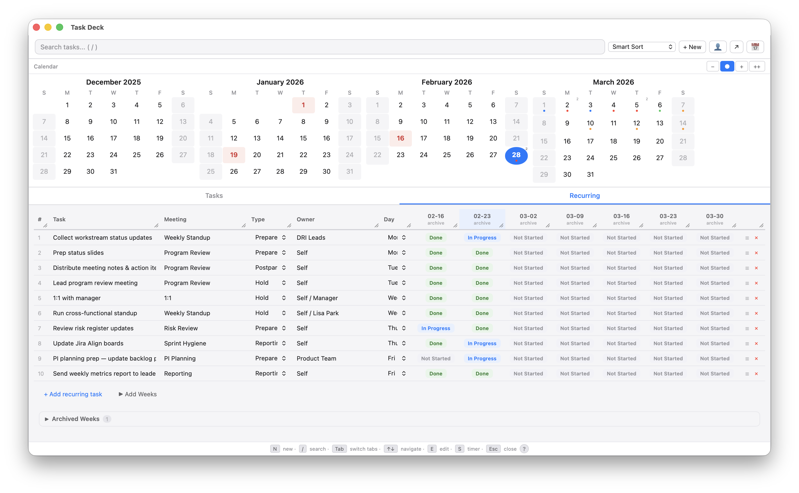
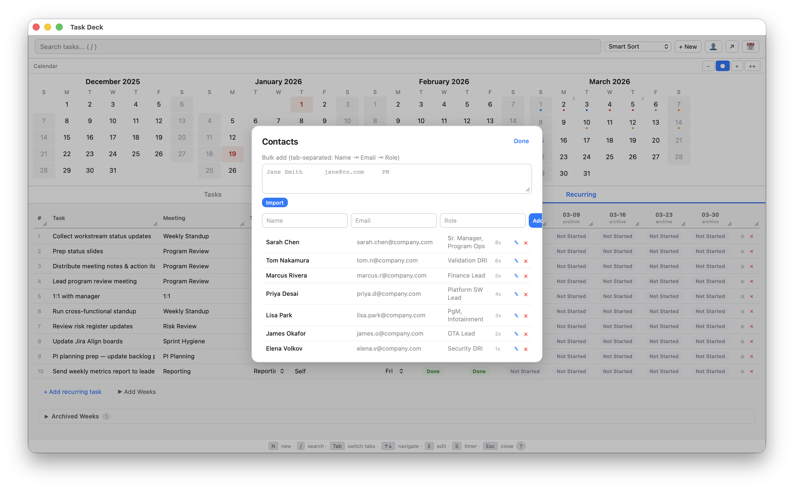
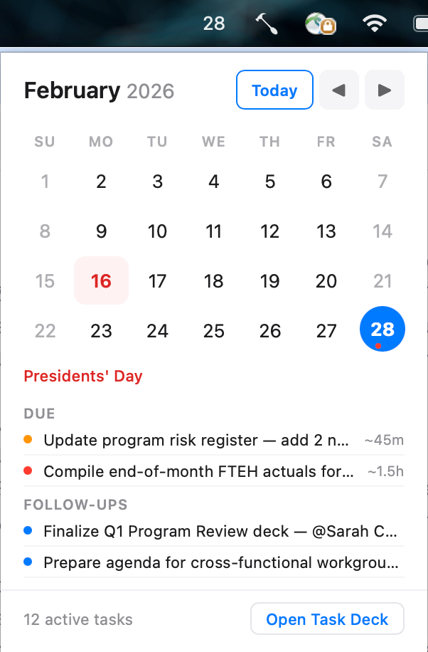
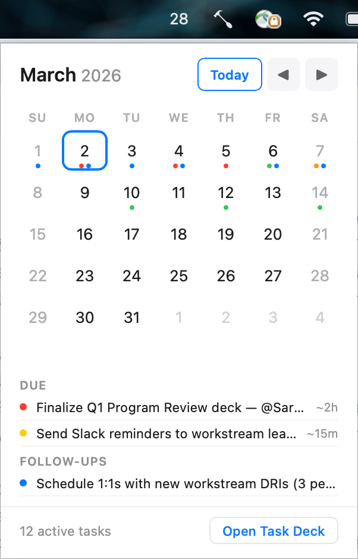

# Task Deck + Menu Calendar for Hammerspoon

A keyboard-driven task manager and menubar calendar built as [Hammerspoon](https://www.hammerspoon.org/) modules for macOS. Designed for program managers, engineering leads, and anyone who lives in meetings and needs to track work without leaving the keyboard.



## Why This Exists

Most task managers are either too heavy (Jira, Asana) or too light (sticky notes, text files). Task Deck sits in the middle — it's a fast, local, keyboard-first tool that launches instantly from any app, tracks time, manages recurring meeting prep, and gives you a calendar heatmap of your workload. No accounts, no cloud sync, no electron app eating 500MB of RAM. Just a JSON file and a Lua script.

## Features

### Task Deck (`Ctrl+Alt+C`)

**Task Management**
- Six priority levels (Very Low → Urgent) with color-coded dots
- Five statuses: Not Started, In Progress, Blocked, Done, Closed
- Hard vs. suggested due dates with distinct visual treatment (🔴 hard, 🟡 suggested)
- Due date urgency coloring — overdue (red), today (orange), tomorrow, soon
- Subtasks with expand/collapse (arrow keys)
- Clickable links with labels — open directly or "Open All" for multi-link tasks
- Notes field with full text search
- Categories for grouping (customizable)
- Estimated duration per task



**Smart Sort**
- Composite scoring: priority weight + due date proximity + hard deadline bonus
- An urgent task due in 2 days automatically outranks a low-priority task due today
- Also sort by: Due Date, Priority, Recently Updated, Date Opened, Category

**Built-in Timer**
- Start/pause with `S` key or click ▶
- Persists across sessions (even after restart)
- Running timers pulse in the task list
- Accumulated time shown in edit form with clear option



**Calendar Heatmap**
- Horizontal scrolling calendar (4 zoom levels from compact to expanded)
- Color-coded dots per day based on task urgency: green (low), amber (medium), red (high/hard deadline)
- Blue dots for follow-up dates
- Task count badges at higher zoom levels
- Click any day to filter tasks to that date
- Holiday highlighting (red background) with bulk import



**Filter Pills**
- Quick filters: Overdue, Due Today, Next 3 Days — each with live count badges
- Combine with search for powerful task discovery

**Recurring Tasks Tab**
- Spreadsheet-style table for weekly recurring work
- Columns: Task, Meeting, Type (Prepare/Hold/Postpare/Reporting), Owner, Day of Week
- Week columns with status cycling: click to toggle Not Started → In Progress → Done
- Current week highlighted in blue
- Archive/restore weeks, bulk delete old data
- Add Weeks button to extend the timeline
- Inline editing on all fields, resizable columns



**@-Mentions & Contacts**
- Type `@` in title or notes to tag contacts
- Autocomplete dropdown sorted by most-tagged
- Contact manager with bulk import (tab-separated paste)
- Tagged contacts render as blue links in task titles



**Export**
- JSON (full data backup)
- CSV for tasks (Excel-compatible)
- CSV for recurring tasks

**Keyboard Shortcuts**

| Key | Action |
|-----|--------|
| `Ctrl+Alt+C` | Open/close Task Deck |
| `N` | New task |
| `E` | Edit selected task |
| `S` | Start/pause timer |
| `/` | Focus search |
| `Tab` | Switch Tasks ↔ Recurring |
| `↑` `↓` | Navigate tasks |
| `→` `←` | Expand/collapse subtasks |
| `⌘+Enter` | Save form |
| `Esc` | Close modal / clear filter / close |
| `?` | Help overlay |

---

### Menu Calendar (menubar)

A lightweight menubar calendar that shows today's date number and drops down a full monthly calendar on click.



**Features**
- Displays current date number in the macOS menu bar
- Click to open a clean monthly calendar popup
- Previous/next month navigation with "Today" quick-jump
- Reads tasks from Task Deck's `tasks.json` — shows urgency dots on days with tasks
- Agenda view below the calendar shows tasks and follow-ups for the selected day
- Holiday display from shared holiday data
- Double-click any agenda item to open Task Deck filtered to that date
- "Open Task Deck" button passes the selected date as a filter
- Auto-updates date at midnight and on wake from sleep
- Click outside or press `Esc` to dismiss



---

## Installation

### Prerequisites
- macOS
- [Hammerspoon](https://www.hammerspoon.org/) installed and running

### Setup

1. Download `taskmanager.lua` and `menucal.lua` to your Hammerspoon config directory:

```bash
cp taskmanager.lua ~/.hammerspoon/taskmanager.lua
cp menucal.lua ~/.hammerspoon/menucal.lua
```

2. Add these lines to your `~/.hammerspoon/init.lua`:

```lua
require("taskmanager")
require("menucal")
```

3. Reload your Hammerspoon config (click the menu bar icon → Reload Config).

4. Press `Ctrl+Alt+C` to open Task Deck. Click the date number in your menu bar for Menu Calendar.

### Data Storage

All data is stored locally in `~/.hammerspoon/tasks.json`. Both modules read from the same file. The file is human-readable JSON — you can back it up, version control it, or edit it directly.

---

## Screenshot Guide

| View | What It Shows |
|------|---------------|
| Main View | Task list with priority dots, status pills, due dates, timer, category labels, and links |
| Calendar Heatmap | Multi-month calendar with colored urgency dots and task count badges |
| Task Form | Edit modal with all fields: title, priority, status, dates, links, notes |
| Timer Running | A task with an active pulsing timer badge |
| Recurring Tasks | Spreadsheet tab showing weekly meeting prep with status cycling |
| Contacts | Contact manager with @-mention autocomplete |
| Filter Pills | Overdue / Due Today / Next 3 Days quick filters with count badges |
| Help Overlay | Full keyboard shortcut and feature reference |
| Menu Calendar | Menubar popup with monthly calendar, agenda, and task dots |
| Menu Calendar Agenda | Selected day showing due tasks and follow-ups |

---

## Sample Data

The included `tasks-demo.json` contains realistic sample data for a program manager workflow:
- 12 active tasks across multiple categories and priorities
- 2 completed tasks
- Subtasks with expand/collapse
- Running timer on one task
- 10 recurring weekly tasks (program review, standups, reporting)
- 7 contacts with tag counts
- US holidays for 2026

To try it:
```bash
# Back up your real data first
cp ~/.hammerspoon/tasks.json ~/.hammerspoon/tasks-backup.json

# Load demo data
cp tasks-demo.json ~/.hammerspoon/tasks.json

# When done, restore your data
cp ~/.hammerspoon/tasks-backup.json ~/.hammerspoon/tasks.json
```

---

## Architecture

Both tools are built as Hammerspoon `hs.webview` windows with embedded HTML/CSS/JS. The Lua layer handles:
- Hotkey registration and window lifecycle
- JSON file I/O (read/write to `tasks.json`)
- URL opening via `hs.urlevent`
- Export to Desktop (JSON/CSV)
- Window geometry persistence
- Previous window refocus on close
- Cross-module communication (Menu Calendar → Task Deck date filtering)

The HTML/JS layer handles all UI rendering, state management, sorting, filtering, and user interaction. Communication between JS and Lua goes through `webkit.messageHandlers`.

---

## License

MIT — use it, modify it, share it.
